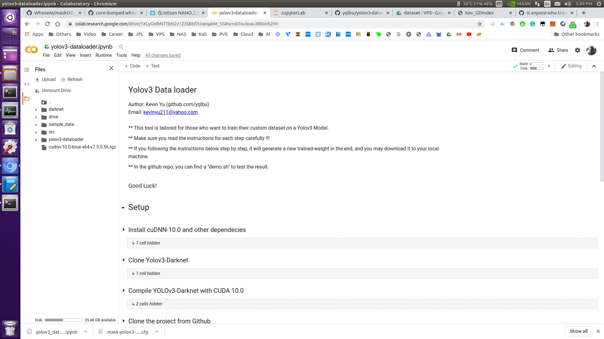

# yolov3-dataloader-colab
 
This tool is tailored for those who want to train their custom dataset on a Yolov3 Model using Colab. \
You may find more info about Google Colab [here](https://medium.com/deep-learning-turkey/google-colab-free-gpu-tutorial-e113627b9f5d).

### Prerequresites

- A valid Google Account to login to Colab
- Setup Yolov3 Darknet correctly on your local machine. If you are a Nvidia Jetson user, you may find instuctions [here](https://pysource.com/2019/08/29/yolo-v3-install-and-run-yolo-on-nvidia-jetson-nano-with-gpu/)

### How to use

- Clone this repository to your local machine by typing the command below in your terminal \
  $ git clone https://github.com/yqlbu/yolov3-dataloader/
- Login to Colab [here](https://colab.research.google.com/)
- Upload "yolov3-dataloader.ipynb" to Colab. You may find the open tab @ File >> Open Notebook

