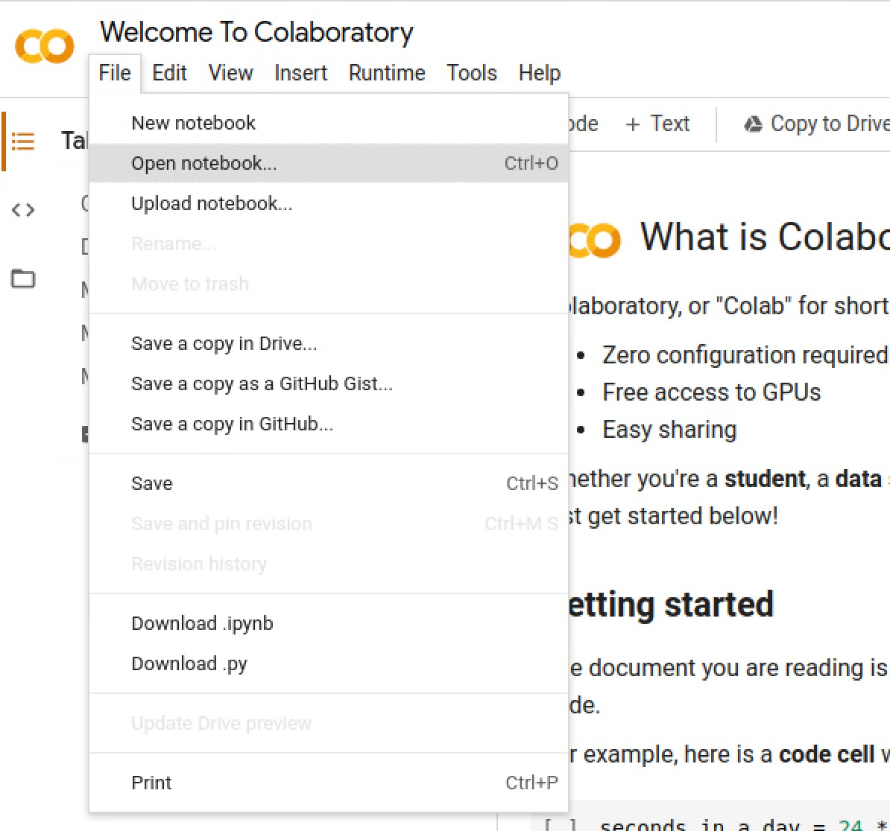
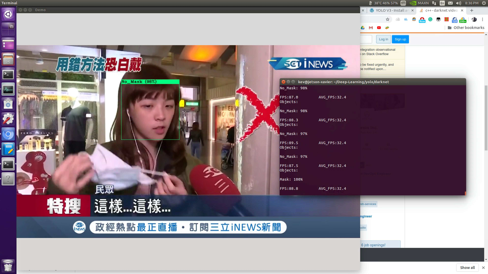

## YOLOv3 Dataloader on Local Machine
 
This tool is tailored for those who want to train their custom dataset on a Yolov3 Model on their local machines. \
You may load any dataset into this tool, it will generate a trained weight in the end of the process. \
You may use this tool on **Google Cloud VM Instances** as well, as long as it is equipped with a **Nvidia GPU**. Ideally using K80, P100 would be good for testing.

### Prerequresites

- This tool contains all the required software dependencies for this project, you do not need to install them from cmd line.
- Unfortunately, this tool only supports **Nvidia GPU**.

### How to use

- Clone this repository to your local machine by typing the command below in your terminal \
  $ git clone https://github.com/yqlbu/yolov3-dataloader-cloud/
- During the training process, you may also monitor the GPU load with gpustat tool \
```
$ pip install gpustat
$ gpustat
```

$ pip install gpustat
$ gpustat
  
### Demo




